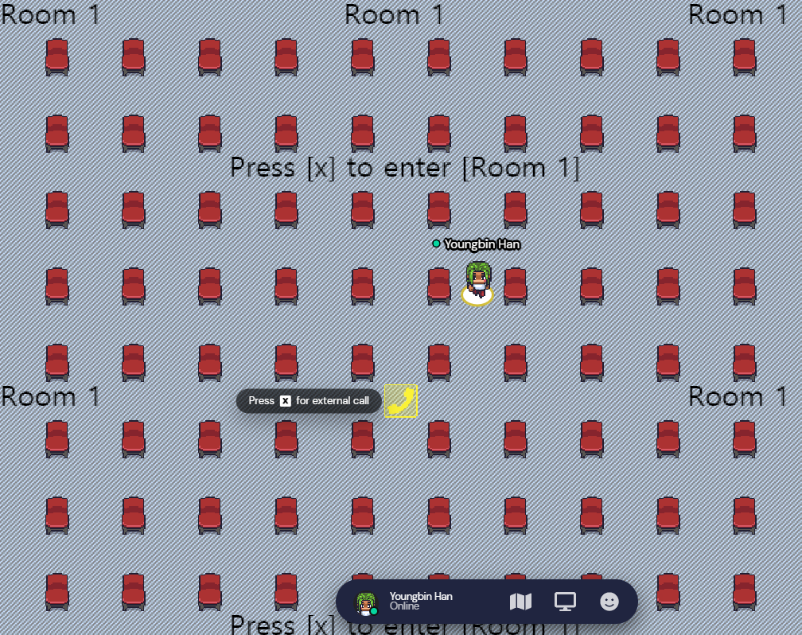

Hi everyone! The first UbuCon Asia coming in less then a month!

On this first UbuCon Asia, We'll also have an additional virtual space: Gather Town space
We'll use both Eventyay and Gather Town. 

- Eventyay for ticketing, timetable, video conference calls and Sponsor/Partner Community information page(Exhibition page)
- Gather Town space for Virtual booth(for sponsors and partner communities) and Networking between attendees! 

Since we made decision on this very recently, Other then Virtual booth details, We don't have plans on other details yet.
But, The event is just around the corner! So we're working with content team to bring ideas on Gather space map design quickly.
We'll give you more updates if we have some progress on building gather space.

## Current virtual booth prototype, Integration with eventyay.
Since we'll use both Eventyay and Gather, two platforms will be integrated so that attendees can switch easily whenever they want.
- On Eventyay, We'll put button that takes you to Gather space.
- On Gather space, We'll place an special area(or object) that takes you to Eventyay Video Call.

See Virtual booth prototype from the video below.



## For Sponsors, Partner Communities
Want to join with Virtual booth on Gather space? We'll soon contact every sponsors and partner community via email.
Simply let us know whether you want a virtual booth on gather space or not.
If you want, We'll set up the virtual booth for you.

Contact us if you got any quesiotns regarding virtual booth on Gather space

- Sponsors: Contact sponsors@ubucon.asia
- Partner Communities: Contact contact@ubucon.asia

> Just a note: Our email sometimes lands on spam, please also check spam if you can't find email from us on your inbox.

## Register for the event today!

Want to meet Ubuntu community people on Gather space? [Register here for free today!](https://eventyay.com/e/75ac7f83)  
The event is just around the corner! See you on Sept 25-26! 