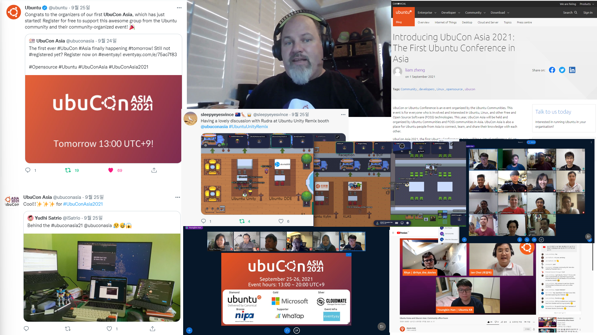
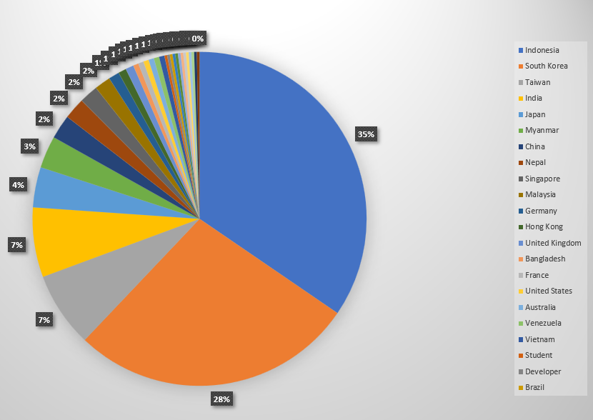
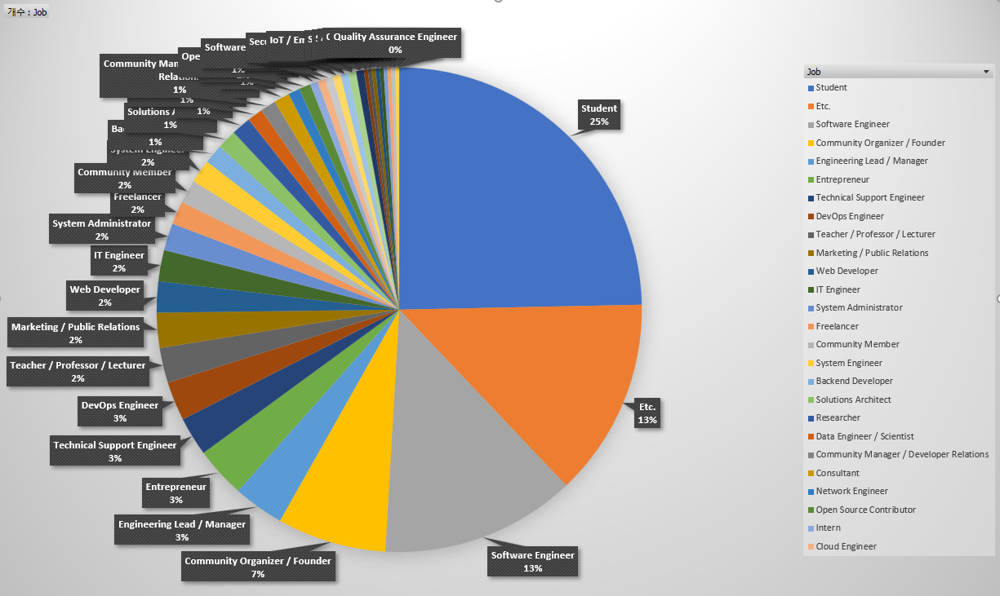
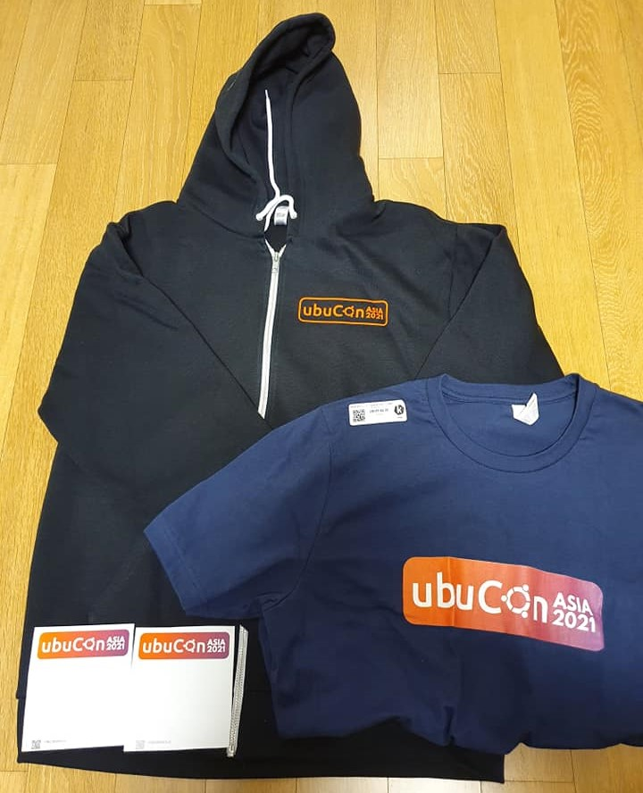

---
title: "UbuCon Asia 2021 Final report"
date: 2021-12-01T23:30:00+09:00
authors:
    - name: Youngbin Han
      bio: Organizer, Ubucon Asia 2021 / Leader, Ubuntu Korea Community 
      email: youngbin@ubuntu-kr.org
      launchpad: sukso96100
      github: sukso96100
      profile: https://avatars2.githubusercontent.com/u/1916739?s=460&v=4
      linkurl: https://youngbin.xyz
      linklabel: Website
---

It’s been about a year since we started to gather organizers, form a team. And last September, with a lot of support from Ubuntu Community and other many Free and Open Source Communities around Asia, We successfully organized the first UbuCon Asia which was a virtual event.

With this report, We would like to wrap-up and finalize our event activities for this year. Then we would like to think about how we can do better at the next UbuCon Asia. We hope this report would be helpful for other Ubuntu community folks who would like to organize similar events.

## The organizing team

We started to gather organizing team members about a year ago. In the beginning, We were planning a much smaller event with a smaller team and just streaming pre-recorded videos. But after publishing a post on discourse and early organizers try to bring much more people. The team got much larger than expected, And also we started to plan a different event with a larger scale. 

These are our organizers from Ubuntu LoCos around Asia

* Korean LoCo: Youngbin Han, Gunyoung Yoon, Gyuseok Jung
* Japanese LoCo: Fumihito Yoshida
* Chinese LoCo: Aron Xu, Liam Zheng
* Taiwan LoCo: Matthew Lien, RJ Hsiao
* Hong Kong LoCo: Jeremy Cheng, Koala Yeung, Vincent Wong
* Malaysian LoCo: Khairul Aizat Kamarudzzaman, Robbi Nespu
* Myanmar LoCo: Ko Ko Ye

We also have organizers from various Free and Open Source communities. For some regions, We tried to bring Ubuntu LoCo to their region first. But after trying contacting some Ubuntu LoCos, We found that some of them are not interested in joining or don't have any time or enough resources to join. So we accepted those who are much more eager to organize the event even if they are not Ubuntu LoCo.

* GNOME Indonesia: Yudhi Satrio
* OpenStack Indonesia: Sartika Lestari
* FOSS Nepal: Ravi Bhattarai, Rhoit Man Amatya
* FOSSASIA: Hong Phuc Dang
* Debian Malaysia: Robbi Nespu (Also member of Ubuntu MY LoCo)

We had more organizers on the team, But on this report, We excluded some people who really didn’t participate.

[See this page on wiki for a full list of organizers.](https://wiki.ubuntu.com/UbuconAsia/2021/Organizers)

### Meeting

After gathering organizers for about 3 months, We tried to find the best time for bi-weekly meetings, and initiated our first meeting in early February. At first, We had a meeting by video call. But soon we found some problems with communication: Various differences in speaking speed, accent, pronunciation and fluency became a language barrier for some people, causing some people to follow up the meeting. Some people with poor network connection couldn't even join the meeting.

So we switched to text chat meetings on telegram(which was our main communication) with the same meeting schedules. We had total 17 bi-weekly meetings.

[See this page on wiki to find our meeting minutes.](https://wiki.ubuntu.com/UbuconAsia/2021/MeetingMinutes)

## Partner Communities

There were many Partner Communities (or Community Partners) who joined us to make this event happen. Most of them helped us to spread UbuCon Asia much further. But some of them helped us more than that. We thank every partner community for their many efforts on this event.

* [WSL Korea User Group(WSLHUB)](https://2021.ubucon.asia/sponsors/wslhub/)
    * For spreading the event, bringing speakers.
* [Kelompok Linux Arek Suroboyo(KLAS)](https://2021.ubucon.asia/sponsors/klas/)
    * For spreading the event, Organizing pre road-show to engage with potential attendees, and bringing speakers.
* [.Net Dev](https://2021.ubucon.asia/sponsors/dotnetdevkr/): For spreading the event
* [OpenStack Korea User Group](https://2021.ubucon.asia/sponsors/openstack-kr/)
    * For spreading the event, and for providing advice on sponsorship programs and finances.
* [Gimpscape.ID](https://2021.ubucon.asia/sponsors/gimpscape-id/): For spreading the event, bringing speakers, designing beautiful marketing materials.
* [Ubuntu Kylin](https://2021.ubucon.asia/sponsors/ubuntu-kylin/): For spreading the event, bringing speakers, and bringing subtitle volunteers.
* [Ubuntu Unity Remix](https://2021.ubucon.asia/sponsors/ubuntu-unity-remix/): For spreading the event, and bringing speakers
* [Ubuntu DDE Remix](https://2021.ubucon.asia/sponsors/ubuntu-dde-remix/): For spreading the event

## Event programs

We had 2 days of programs for our event. with various types and topics.

### Sessions

We received 48 proposals and choosed 33 sessions.

|||
|--|--|
| Workshops | 3 |
| Panel discussions | 1 |
| Lightning talks | 5 |
| Talks (Including Opening and Keynote) | 24 |
| **Total** | **33** |

### Gather town and Social events

At the beginning, there were no plans about Gather town. But as we gathered enough sponsorship and individual donation, We were able to add plans for Gather town venue. We used Gather town to feel like a virtual conference a little closer to the in-person event.

#### Virtual booth for Sponsors and Partner communities

With Gather space, We could offer virtual booths on Gather additionally to sponsors and partner communities. And allow them to interact with attendees in a way that feels more human. To increase engagement between booth staff and attendees, We also prepared a “booth” swag lottery.

#### Social event

The social event was on Day 1, And it was finding hidden treasure in Gather space.We placed 4 hidden treasures, and some hints to unlock treasure on some different places of gather space.

#### More on Gather town

There were also many other things that attendees might have enjoyed, private rooms for BOFs (although we didn’t have official BOFs schedule and programs) and virtual beaches that may make people feel like they're on vacation.

- [See this page for more details on Gather town](https://2021.ubucon.asia/venue/)
- [You can still visit the Gather space (although it’s empty)](https://gather.town/app/iszDc38mbZ3r7GXq/UbuCon%20Asia%202021)

### Subtitles

When gathering organizers, many of them worried about gathering enough speakers because of language barriers. That made us take the language matter of speakers into account from the beginning. There were a lot of suggestions on accepting sessions in diverse languages. Our decision this time was providing English subtitles for sessions in native language. To do that, We used Speech-to-text and Translation API to generate subtitles and it’s translation. Then get help from volunteers to review and post-edit the generated subtitles. Thanks to many dedication from volunteers, We could translate 15 videos into English and spread their stories around the globe. And some volunteers even translated English sessions into their native languages.

Subtitles are of course available on our videos on YouTube, and also available as files on GitHub under CC-BY-SA 4.0. [You may find them here.](https://github.com/ubucon-asia/2021-video-subtitles)

| - | Volunteers | In to English | Used generated subtitles | Wrote from scratch |
| -- | -- | -- | -- | -- |
| Korean | 3 | 5(3 Talks, 2 LTs) | 5 | 0 |
| Japanese | 1 | 1(Talk) | 0 | 1 |
| Chinese(China) | 2 | 3(2 Talks, 1LT) | 3 | 0 |
| Chinese(Taiwan) | 7 | 1(Talk) | 0 | 1 |
| Indonesian | 6 | 5(4 Talks, 1LT) | 5 | 0 |
| **Total** | 19 | 15 | 13 | 2 |

## Attendees

* Many people around Asia registered for the event.
* Total 385 Registrations
* 203 Views, 117 Net Viewers (YouTube Channel Analytics, Sept 25-26)
    * Based on this numbers, We presume that number of Check-Ins should be around 150~160
* Most people are from Indonesia, South Korea and Taiwan. There are also people from various regions.
* 25% of participants were Students. 60% were professionals who work in the field. Most of them were Software Engineer(Software Engineer, Web, Frontend, Backend) and Engineers who work on Infrastructures (IT, System Administrator, System Engineer, DevOps, Technical Support Engineer, Network Engineer), Marketing, Community Manager, Organizers, and much more.

## Sponsorship and Finances

### Earnings

With many dedications of our organizers, We could bring 6 sponsors including Ubuntu(Diamond), Microsoft(Gold), Cloudmate(Silver), NIPA(Bronze), WhaTap Labs(Supporter), Eventyay(Event Infra).
And 7 Individual patrons including Ubuntu Japanese LoCo who donated their budget to the UbuCon Asia team for the success of the event. [See this page to have a look at the list of our patrons.](https://2021.ubucon.asia/patrons/)
Thanks to FOSSASIA becoming Fiscal host and Legal partner of UbuCon Asia 2021, We could make contracts with sponsors and manage finances much easier.

| - | USD | SGD |
| -- | -- | -- |
| Sponsorship | 8,297.00 | 9,337.80 | 
| Donations Tickets | 1,193.90 | 0 | 
| **Total earnings** | **8,069.96** | **9,337.80** |

### Spendings

We spent less than what we expected. There were spending plans on Google Workspace, Social Media Ads, Video Editor subscriptions, But As we replaced Google Workspace with Dooray! free plan, Social Media Ads found not effective, and not subscribing to Video Editor software. We could save many spendings.

| Category | Description | USD | SGD
| -- | -- | -- | -- |
| IT Infrastructure | Gather Town | 0 | 1,257.51 |
| IT Infrastructure | Google Cloud | 0 | 227.94 | 
| Merchandise | Spreadshop | 0 | 8,049.69 |
| Merchandise | Threadless | 0 | 418.16 | 
| Other | Accounting Fee (15% of Total earnings) | 1,420.94 | 1,400.67
| - | **Total spendings** | **1,420.94** | **11,355.97** |

### Remaining amounts

For the remaining amount, Korean LoCo will receive it and keep it until the next UbuCon Asia. Korean LoCo plans to donate 5~10% of the remaining amount to Ubuntu donations funding which would benefit most of Ubuntu LoCo who might be organizing their local events or next UbuCons.

| - | USD | SGD |
| -- | -- | -- |
| Ending balance | 8,051.96 | -2,018.17 |
| SGD Ending balance in USD* | -1,469.83 | ↲ |
| **Remaining** | **6,582.13** | **0** |

> *Exchange rate on 1 Dec 2021: 1 SGD = 0.7283 USD (DBS)

## Swags

When organizing In-Person event, We can just order swags from local producers with quotations and deliver packages to the venue and distribute swags to attendees on-site. But what about online events? Swags will need to be delivered to each attendees worldwide, Which is difficult to be done by few organizers or volunteers.

We chose swag producers that can ship to individuals globally. And rather than collecting attendees’ personal information(such as shipping address). We opened custom swag shops with the solution provided by swag producers. (Spreadshirt.com Spreadshop and Threadless.com Artist Shop) then distributed gift cards that can be redeemed on our swag shops.

We thought the way we chose would be the perfect solution for distributing swags. But there is always no such silver bullet that solves everything. We faced some issues while distributing gift cards: When ordering a lot of gift cards, Sometimes swag producers provided us with wrong or already expired gift cards. There were also cases that the swag producer does not ship swags to the region where our speaker or attendees live.

As we are already done with distributing gift cards, We no longer distribute additional free gift cards. But you can still order one from our swag shop. We configured the price margin to zero at the swag shop. So that you can buy them at a cheaper price.

- Spreadshop: [https://ubucon-asia-2021.myspreadshop.com/](https://ubucon-asia-2021.myspreadshop.com/)
- Threadless: [https://ubuconasia.threadless.com/](https://ubuconasia.threadless.com/)

## What we learned and What we can do better next time

With the success of the first UbuCon Asia, Although it was a virtual event, We confirmed that there were a lot of Ubuntu LoCos in Asia and many of them are very interested in organizing this kind of global event or global joint project.

Organizing this event was not always flawless. We got a lot of diverse people (about 30 people) in the same telegram group, and expected diverse speakers and ideas. And we got diverse speakers and a bunch of ideas as expected. But there were also a lot of different best practices, views and backgrounds of organizers, event experiences, choosing speaker submissions and opinions. which resulted in a lot of conflicts on making decisions.

As it was the first UbuCon Asia, there were no guidelines overall for organizing UbuCon Asia. Having a guideline on organizing UbuCon Asia would reduce conflicts on making decisions: Such as guidelines for sponsorship, choosing speaker proposals, event format, event organizing process and recommended schedule and scale.

We don’t have any guidelines, But as we now have a reference for organizing UbuCon Asia, It would not be difficult to write some guidelines for that.

## Next year?

We don’t have any plans for organizing UbuCon Asia for next year (which would be UbuCon Asia 2022) yet. As the COVID-19 situation is getting better with vaccinations and COVID-19 medicine these days, It is expected that in-person or hybrid UbuCon Asia might be possible next year. But whether in-person or hybrid will be possible will also depend on border policy and quarantine policies of governments of each country. And we will also need to see how the situation goes. For now, We’ll have some break until at least the end of this year. And begin discussing UbuCon Asia 2022 early next year.

## Special thanks

There are a lot of people who contributed to the success of this first event, not just our organizers, speakers, sponsors, participants, community partners and patrons. We’re listing some of them below to thank them for their contribution whether it’s small or big.

* Monica and Ubuntu community team on Canonical. - For bringing attention from the community and gathering awesome speakers and sponsorships.
* Ian Y. Choi and Seongsoo Cho from OpenStack Korea - For sharing their experience and advice on gathering sponsorships.
* Kukuh Syafaat from openSUSE Indonesia - For translating our website and its contents into Indonesian.
* Ubuntu Weekly Newsletter team - For spreading our event a lot further!
* Diogo Constantino, Tiago Carrondo from Ubuntu Portugal LoCo - For sharing their experiences on gathering sponsorship, and spreading our event further.
* Gimpscape ID - For designing some posters for our event!
* Hilwood Yang from openSUSE China - For helping us to get in touch with Ubuntu community folks in China.
* Sammy Fung from Opensource HK - For helping us to gather organizers around Asia.
* A lot more folks not listed here, And You!

We sincerely thank everyone who contributed or participated in our event.  
We hope we can see you again at the next UbuCons or other events. Thank you & Stay healthy!

**Youngbin Han**  
On behalf UbuCon Asia 2021 team  
& Ubuntu Korea Community(Ubuntu Korean LoCo)  

> You may also [see this report on Google Docs at here](https://docs.google.com/document/d/e/2PACX-1vRfRPNhvwuxhawpGFfH7jOuU8rErK_uxHwXiHIkm6hi4EbbNahkFOiN98XAxksq87Oq2ukkPzLZolM8/pub) or [as PDF file at here](UbuCon_Asia_2021_Final_Report)