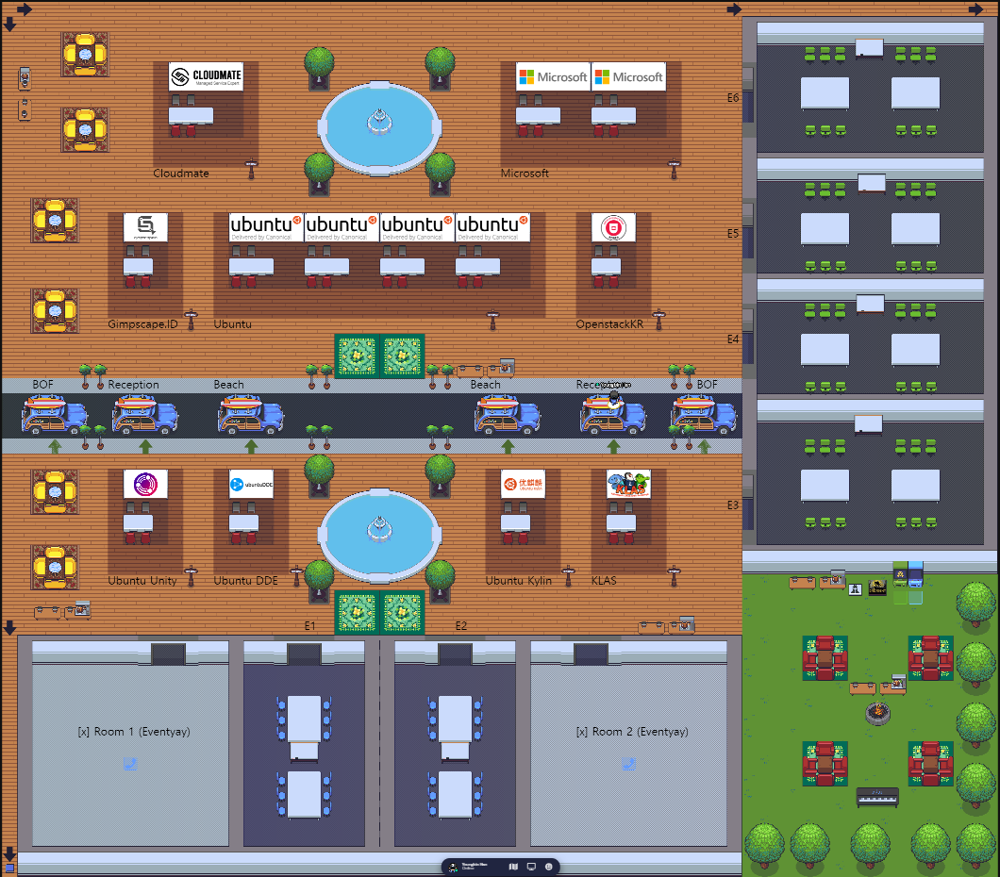
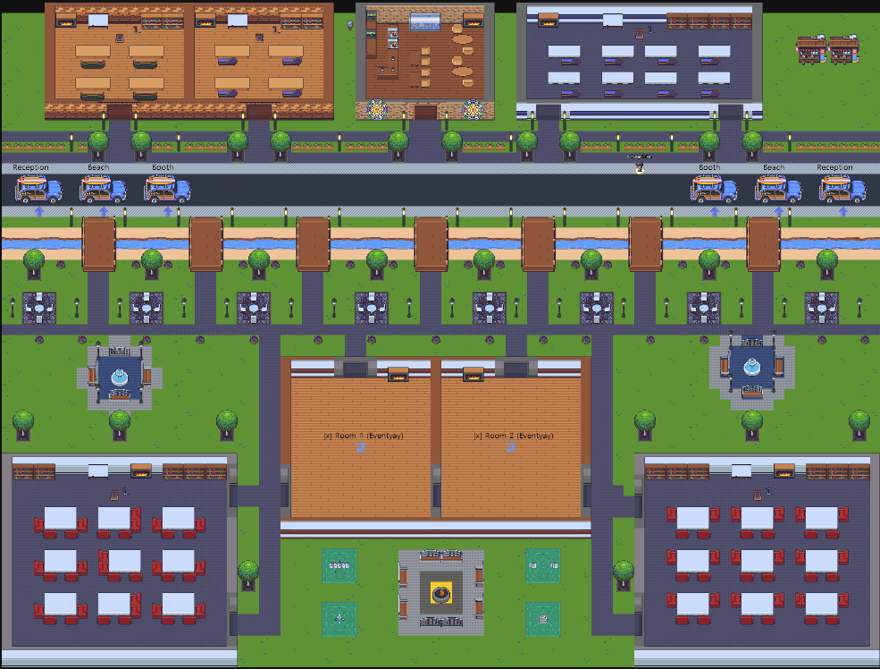

For Sponsor & Partner Community Virtual booth and To Socialize Attendees, We have Gather space for the event.
Hope you enjoy our Gather space, meet new people and also make new opportunities!

# Entering Gather space & Going back to Eventyay

- To join Gather space, Join the event room on eventyay first, Then click "Gather.town space" on sidebar. That brings you to Gather space.
- To go back to eventyay video call, You may find dedicated areas for going back to eventyay. Move your avatar and press `X` key to go back.

# Virtual Booth
We have virtual booth from our Sponsors and Partner Communities. Visit their booth and learn about them while booth is running.
Please note that booth hours are vary by each booth. Please refer to the table below for booth hours.

| Booth | Day 1 booth hours | Day 2 booth hours |
|--|--|--|
| Ubuntu | | |
| Microsoft | | |
| Cloudmate | 15:30 ~ 17:00 (UTC+9) | 15:30 ~ 17:00 (UTC+9) |
| Ubuntu Unity Remix | 13:30 ~ 17:30 (UTC+9) | 13:30 ~ 17:30 (UTC+9) |
| Kelompok Linux Arek Suroboyo (KLAS) | 19:15 ~ 19:45 (UTC+9) | 18:15 ~ 18:45 (UTC+9) |
| Gimpscape.ID | | |
| Ubuntu DDE Remix | | |
| Ubuntu Kylin | (X) | 14:45 ~ 15:15 (UTC+9)) |
| Openstack Korea User Group | (X) | During event hours |

## Swag lottery on Virtual booth
For thoese attendees who actively participate virtual booth activities on various booth,
You can apply for swag lottery at each booth. (Single time for each booth)

> Note: If you apply lottery at same booth multiple time, that will be marked as duplicate.

Afther you participating booth activity at each boott, Booth staffs will ask you for your **Eventyay ticket Order Number**
Simply give booth staffs your order number via private message.

### Where can I find my Eventyay ticket Order Number? How does it looks like?

 - On eventyay, go to “my tickets” page
 - Find and click ticket for UbuCon Asia 2021
 - On the ticket details page, Click the “Download invoice” button.
 - Open downloaded invoice, You may find order number on your invoice

Your order number looks like this:
`O1234567890-12345 (O{10 digits}-{5digits})`

# Gather space Maps

There are multiple rooms in our Gather space and some of them are huge.
Refering maps below might be helpful to not get lost on Gather space.

## Reception

## Booth

## Beach

## BOF
